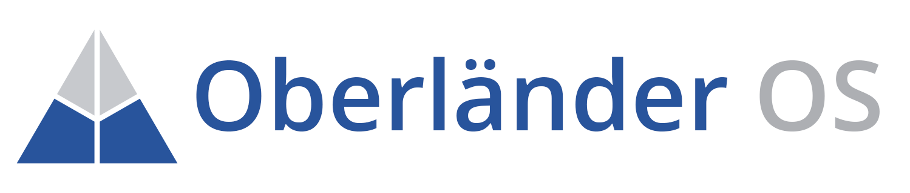

OberländerOS
=============

OberländerOS is a multitasking operating system for embedded devices. The aim of this project is to learn how to develop a full operating system from scratch. The main target platform for the OS is the BeagleBoard-xM.  